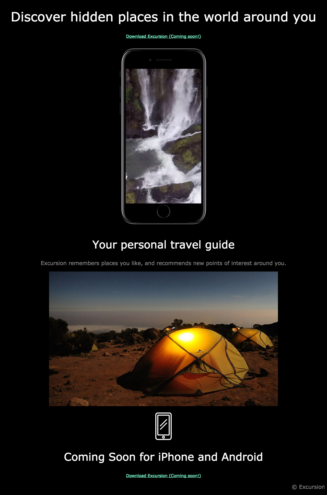

# Excursion Website Project
> I built a website using HTML5 and CSS3.
## Table of Contents
* [General Info](#general-information)
* [Technologies Used](#technologies-used)
* [Screenshots](#screenshots)
* [Setup](#setup)
* [Usage](#usage)
* [Project Status](#project-status)
* [Acknowledgements](#acknowledgements)
* [Contact](#contact)
<!-- * [License](#license) -->
## General Information
- This fun project is to show case my intermeidate HTML and CSS skills. I hope you enjoy it!

- Load the file and see how the video autoplays!
- Project Objectives:
  - Build a webpage using HTML and CSS
  - Use Git version control
  - Use command line
  - Local development
- This is a portfolio project to showcase intermediate web design, implementation, and version control skills.
- I started this project following the Codecademy's Full Stack Engineering Path.
## Technologies Used
- HTML5
- CSS3
- Git and Github
- Command Line
- VSCode

## Screenshot

## Setup

For this project to work in your own computer, you need to install HMTL5 and CSS3. Clone this repository in your own MAC/PC and follow usage instructions.
## Usage

After downloading this folder (cloning the repository on to your local development environment), go to the files location and open up your terminal. Type the following code:

open index.html

 or

double-click on the index.html file and it should open in your main browser.

## Project Status
_Completed_

## Acknowledgements
Give credit here.
- This project was inspired by Codecademy.
- This project couldn't have been completed without StackOverflow and w3schools.com!

## Contact
Created by @armaankara - feel free to contact me!

## License
This project is open source.
